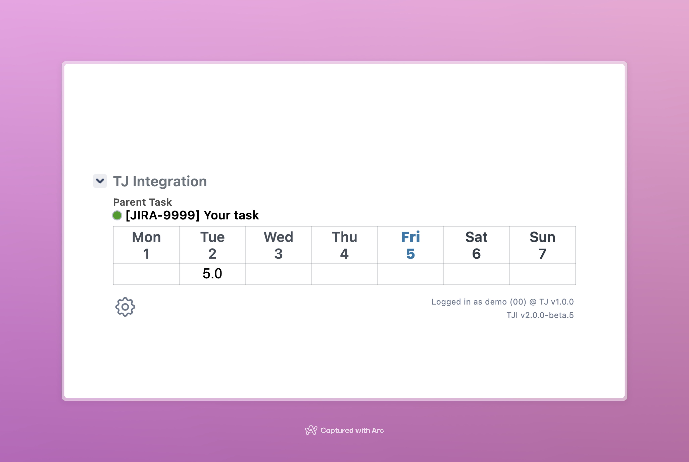

    <h1>TJ Panel for Adobe's Jira</h1>

 

    
      
    
    

## Getting started

### Installation

You have two options depending on the browser you use. You can install the script as a **[Userscript](https://en.wikipedia.org/wiki/Userscript)** in all popular browsers or as an **Arc Booster** in the Arc browser.

#### Userscript

1. Install a [Userscript Manager](https://en.wikipedia.org/wiki/Userscript_manager) of your choice. We recommend [Tampermonkey](https://www.tampermonkey.net/) or [Violentmonkey](https://violentmonkey.github.io/).

   > - [Tampermonkey for Chrome](https://chrome.google.com/webstore/detail/tampermonkey/dhdgffkkebhmkfjojejmpbldmpobfkfo) 
   > - [Tampermonkey for Firefox](https://addons.mozilla.org/en/firefox/addon/tampermonkey/) 
   > - [Tampermonkey for Opera](https://addons.opera.com/en/extensions/details/tampermonkey-beta/) 
   > - [Tampermonkey for Edge](https://microsoftedge.microsoft.com/addons/detail/tampermonkey/iikmkjmpaadaobahmlepeloendndfphd) 
   > - [Userscripts for Safari (MacOS/iOS/iPadOS)](https://apps.apple.com/us/app/userscripts/id1463298887) 

2. Install **TJ Jira Panel** by clicking **[this link](../../raw/main/user-scripts/tj-jira-panel.user.js)**.

#### Arc Booster

1. Create a booster for the Jira website.

2. Copy the content of the **[Arc Booster script](./user-scripts/tj-jira-panel.arc.js)** and paste it into the booster.
