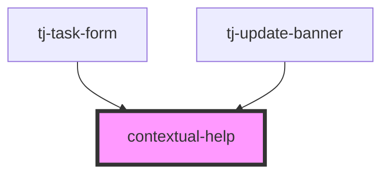

# contextual-help

<!-- Auto Generated Below -->

## Overview

Component providing a button that triggers a popover with contextual help content.

## Properties

| Property               | Attribute | Description                            | Type               | Default     |
| ---------------------- | --------- | -------------------------------------- | ------------------ | ----------- |
| `variant` _(required)_ | `variant` | Controls the icon shown in the button. | `"help" \| "info"` | `undefined` |

## Slots

| Slot        | Description                                                               |
| ----------- | ------------------------------------------------------------------------- |
| `"content"` | The content of the popover.                                               |
| `"footer"`  | The footer of the popover.                                                |
| `"heading"` | The heading of the popover. Styled to be more prominent than the content. |

## Dependencies

### Used by

 - [tj-task-form](../tj-task-page/components/tj-task-form)
 - [tj-update-banner](../tj-jira-panel/components/update-banner)

### Graph

----------------------------------------------

*Built with [StencilJS](https://stenciljs.com/)*
