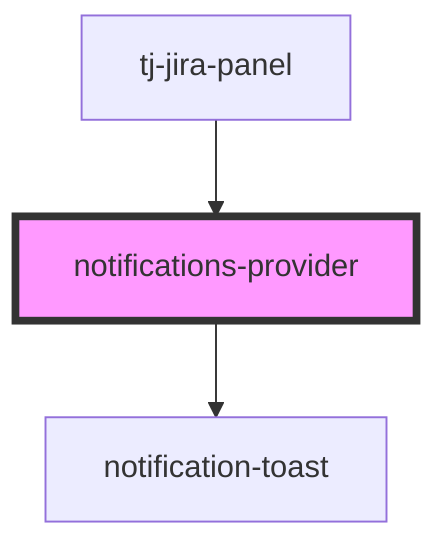

# notifications-provider

<!-- Auto Generated Below -->

## Overview

The `notifications-provider` component is a provider for notifications. It listens for `notification` events and renders `notification-toast` components for each notification.

## Slots

| Slot | Description                                                      |
| ---- | ---------------------------------------------------------------- |
|      | The default slot where the content of your app will be rendered. |

## Dependencies

### Used by

 - [tj-jira-panel](../tj-jira-panel)

### Depends on

- notification-toast

### Graph

----------------------------------------------

*Built with [StencilJS](https://stenciljs.com/)*
