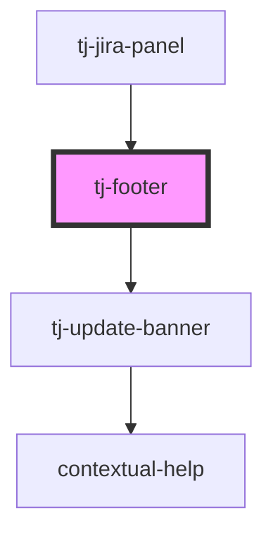

# tj-footer

<!-- Auto Generated Below -->

## Overview

The footer of the panel.
Displays the version of the server and the extension and provides a button to open/close the settings.

## Properties

| Property        | Attribute        | Description                                                                          | Type      | Default     |
| --------------- | ---------------- | ------------------------------------------------------------------------------------ | --------- | ----------- |
| `isLoggedIn`    | `is-logged-in`   | Whether the user is logged in. Certain information is only available when logged in. | `boolean` | `undefined` |
| `scriptVersion` | `script-version` | The version of the script used to inject the panel.                                  | `string`  | `undefined` |

## Events

| Event          | Description                                              | Type                |
| -------------- | -------------------------------------------------------- | ------------------- |
| `hideSettings` | Emitted when the user presses the close settings button. | `CustomEvent<void>` |
| `showSettings` | Emitted when the user presses the settings button.       | `CustomEvent<void>` |

## Dependencies

### Used by

 - [tj-jira-panel](../..)

### Depends on

- [tj-update-banner](../update-banner)

### Graph

----------------------------------------------

*Built with [StencilJS](https://stenciljs.com/)*
