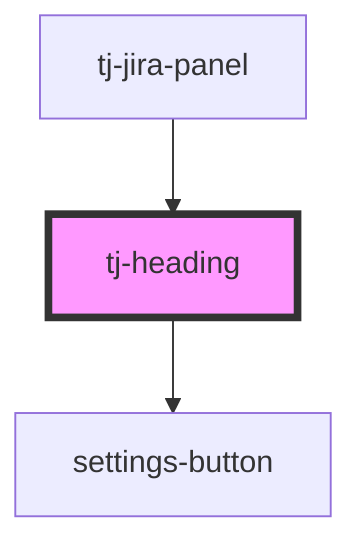

# tj-heading

<!-- Auto Generated Below -->

## Overview

The heading for the TJ panel. It contains the title and a button to toggle the panel.

## Properties

| Property      | Attribute       | Description                                                                          | Type      | Default     |
| ------------- | --------------- | ------------------------------------------------------------------------------------ | --------- | ----------- |
| `isExpanded`  | `is-expanded`   | Whether the panel is expanded or not. This is used to toggle the icon in the button. | `boolean` | `undefined` |
| `isJiraCloud` | `is-jira-cloud` | Whether the panel is using jira-cloud theme or not.                                  | `boolean` | `undefined` |

## Events

| Event         | Description                                                                                    | Type                |
| ------------- | ---------------------------------------------------------------------------------------------- | ------------------- |
| `togglePanel` | Emitted when the user presses the toggle button. This is used to expand or collapse the panel. | `CustomEvent<void>` |

## Dependencies

### Used by

 - [tj-jira-panel](../..)

### Depends on

- [settings-button](../settings-button)

### Graph

----------------------------------------------

*Built with [StencilJS](https://stenciljs.com/)*
