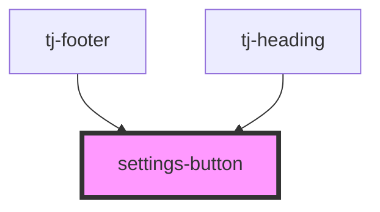

# settings-button

<!-- Auto Generated Below -->

## Properties

| Property | Attribute | Description           | Type     | Default |
| -------- | --------- | --------------------- | -------- | ------- |
| `size`   | `size`    | The size of the icon. | `number` | `24`    |

## Events

| Event          | Description                                              | Type                |
| -------------- | -------------------------------------------------------- | ------------------- |
| `hideSettings` | Emitted when the user presses the close settings button. | `CustomEvent<void>` |
| `showSettings` | Emitted when the user presses the settings button.       | `CustomEvent<void>` |

## Dependencies

### Used by

 - [tj-footer](../footer)
 - [tj-heading](../heading)

### Graph

----------------------------------------------

*Built with [StencilJS](https://stenciljs.com/)*
