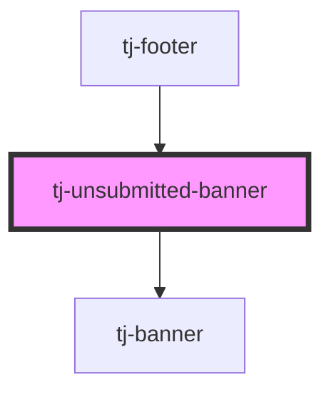

# tj-unsubmitted-banner

<!-- Auto Generated Below -->

## Overview

A banner that warns the user when their previous week's timesheet has not been submitted.
Only renders when the user is logged in and the timesheet is confirmed unsubmitted.
Emits `bannerStateChange` so parent components can react to the submission state.

## Properties

| Property     | Attribute      | Description                                                                         | Type      | Default     |
| ------------ | -------------- | ----------------------------------------------------------------------------------- | --------- | ----------- |
| `isLoggedIn` | `is-logged-in` | Whether the user is currently logged in. The timesheet check is skipped when false. | `boolean` | `undefined` |

## Events

| Event               | Description                                                                                                                | Type                                  |
| ------------------- | -------------------------------------------------------------------------------------------------------------------------- | ------------------------------------- |
| `bannerStateChange` | Emitted after the timesheet API resolves with the submission status. Footer component uses this to track the banner state. | `CustomEvent<BannerStateChangeEvent>` |

## Dependencies

### Used by

 - [tj-footer](../footer)

### Depends on

- [tj-banner](../banner)

### Graph

----------------------------------------------

*Built with [StencilJS](https://stenciljs.com/)*
