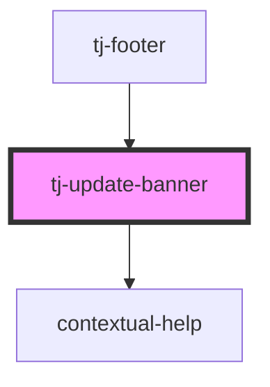

# tj-update-banner

<!-- Auto Generated Below -->

## Overview

A banner that displays when a new version of the component is available.

## Properties

| Property        | Attribute        | Description                                         | Type     | Default |
| --------------- | ---------------- | --------------------------------------------------- | -------- | ------- |
| `scriptVersion` | `script-version` | The version of the script used to inject the panel. | `string` | `null`  |

## Dependencies

### Used by

 - [tj-footer](../footer)

### Depends on

- [contextual-help](../../../contextual-help)

### Graph

----------------------------------------------

*Built with [StencilJS](https://stenciljs.com/)*
