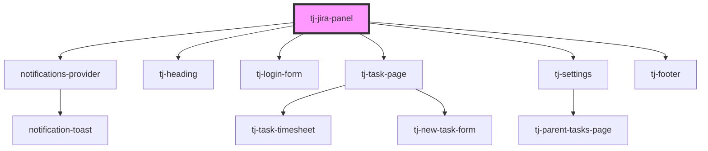

# tj-jira-panel

<!-- Auto Generated Below -->

## Properties

| Property                   | Attribute      | Description                              | Type     | Default     |
| -------------------------- | -------------- | ---------------------------------------- | -------- | ----------- |
| `jiraID` _(required)_      | `jira-id`      | The Jira ID of the task to display.      | `string` | `undefined` |
| `jiraSummary` _(required)_ | `jira-summary` | The Jira summary of the task to display. | `string` | `undefined` |

## Dependencies

### Depends on

- [notifications-provider](../notifications-provider)
- [tj-heading](./components/heading)
- [tj-login-form](../tj-login-form)
- [tj-task-page](../tj-task-page)
- [tj-settings](../tj-settings)
- [tj-footer](./components/footer)

### Graph

----------------------------------------------

*Built with [StencilJS](https://stenciljs.com/)*
