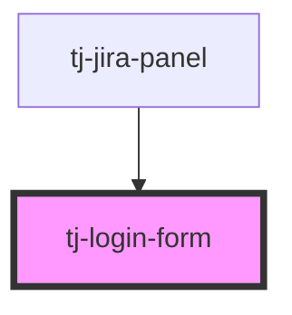

# tj-login-form

<!-- Auto Generated Below -->

## Overview

A form to log into TJ.

## Events

| Event          | Description                                                                                   | Type                        |
| -------------- | --------------------------------------------------------------------------------------------- | --------------------------- |
| `login`        | Emitted when the user logs in.                                                                | `CustomEvent<void>`         |
| `notification` | Emitted when an error occurs. Requires the component to be inside a `notifications-provider`. | `CustomEvent<Notification>` |

## Dependencies

### Used by

 - [tj-jira-panel](../tj-jira-panel)

### Graph

----------------------------------------------

*Built with [StencilJS](https://stenciljs.com/)*
