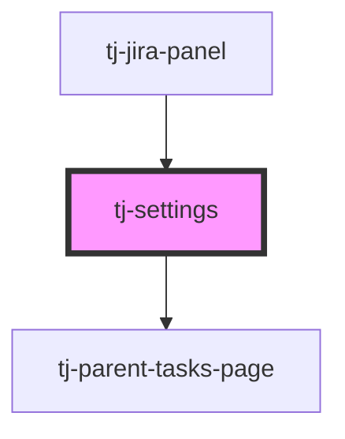

# tj-settings

<!-- Auto Generated Below -->

## Overview

Component for the settings page.

## Properties

| Property     | Attribute      | Description                                                              | Type      | Default     |
| ------------ | -------------- | ------------------------------------------------------------------------ | --------- | ----------- |
| `isLoggedIn` | `is-logged-in` | Whether the user is logged in. Used to determine which settings to show. | `boolean` | `undefined` |

## Dependencies

### Used by

 - [tj-jira-panel](../tj-jira-panel)

### Depends on

- tj-parent-tasks-page

### Graph

----------------------------------------------

*Built with [StencilJS](https://stenciljs.com/)*
