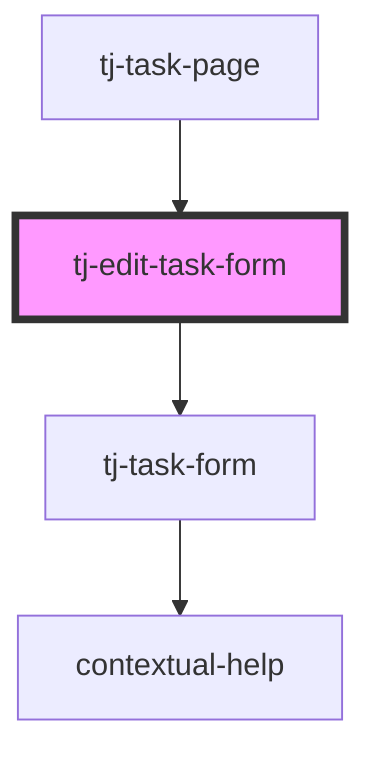

# tj-edit-task-form

<!-- Auto Generated Below -->

## Properties

| Property            | Attribute | Description                                  | Type   | Default     |
| ------------------- | --------- | -------------------------------------------- | ------ | ----------- |
| `task` _(required)_ | --        | The task for which to display the edit form. | `Task` | `undefined` |

## Events

| Event            | Description                                                                                                        | Type                        |
| ---------------- | ------------------------------------------------------------------------------------------------------------------ | --------------------------- |
| `cancelEditTask` | Emitted when the form is cancelled.                                                                                | `CustomEvent<void>`         |
| `notification`   | Emitted when a notification needs to be displayed. Requires the component to be inside a `notifications-provider`. | `CustomEvent<Notification>` |

## Dependencies

### Used by

 - [tj-task-page](../..)

### Depends on

- [tj-task-form](../tj-task-form)

### Graph

----------------------------------------------

*Built with [StencilJS](https://stenciljs.com/)*
