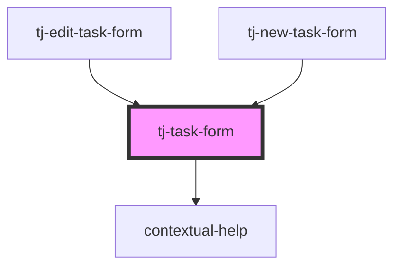

# tj-task-form

<!-- Auto Generated Below -->

## Properties

| Property                 | Attribute          | Description | Type                   | Default                |
| ------------------------ | ------------------ | ----------- | ---------------------- | ---------------------- |
| `buttonLabel`            | `button-label`     |             | `string`               | `'Create'`             |
| `description`            | `description`      |             | `string`               | `undefined`            |
| `name` _(required)_      | `name`             |             | `string`               | `undefined`            |
| `parentId`               | `parent-id`        |             | `string`               | `undefined`            |
| `showDescription`        | `show-description` |             | `boolean`              | `false`                |
| `startDate` _(required)_ | `start-date`       |             | `string`               | `undefined`            |
| `state`                  | `state`            |             | `"active" \| "closed"` | `undefined`            |
| `workKind`               | `work-kind`        |             | `string`               | `User.defaultWorkKind` |

## Events

| Event          | Description                                                                                                        | Type                        |
| -------------- | ------------------------------------------------------------------------------------------------------------------ | --------------------------- |
| `formSubmit`   | Emitted when the form is submitted.                                                                                | `CustomEvent<TaskFormData>` |
| `loaded`       | Emitted when the form is loaded.                                                                                   | `CustomEvent<void>`         |
| `notification` | Emitted when a notification needs to be displayed. Requires the component to be inside a `notifications-provider`. | `CustomEvent<Notification>` |

## Dependencies

### Used by

 - [tj-edit-task-form](../tj-edit-task-form)
 - [tj-new-task-form](../tj-new-task-form)

### Depends on

- [contextual-help](../../../contextual-help)

### Graph

----------------------------------------------

*Built with [StencilJS](https://stenciljs.com/)*
