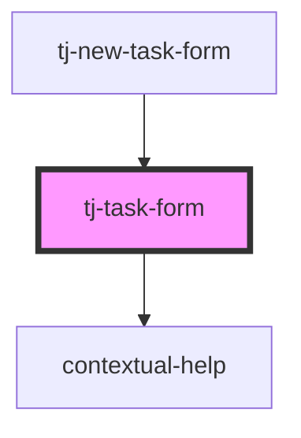

# tj-task-form

<!-- Auto Generated Below -->

## Properties

| Property                   | Attribute          | Description | Type                       | Default     |
| -------------------------- | ------------------ | ----------- | -------------------------- | ----------- |
| `jiraDescription`          | `jira-description` |             | `string`                   | `undefined` |
| `jiraID` _(required)_      | `jira-id`          |             | `string`                   | `undefined` |
| `jiraSummary` _(required)_ | `jira-summary`     |             | `string`                   | `undefined` |
| `monday` _(required)_      | `monday`           |             | `string`                   | `undefined` |
| `parentTasks` _(required)_ | --                 |             | `{ [x: string]: string; }` | `undefined` |

## Events

| Event        | Description | Type                    |
| ------------ | ----------- | ----------------------- |
| `formSubmit` |             | `CustomEvent<FormData>` |

## Dependencies

### Used by

 - [tj-new-task-form](../tj-new-task-form)

### Depends on

- [contextual-help](../../../contextual-help)

### Graph

----------------------------------------------

*Built with [StencilJS](https://stenciljs.com/)*
