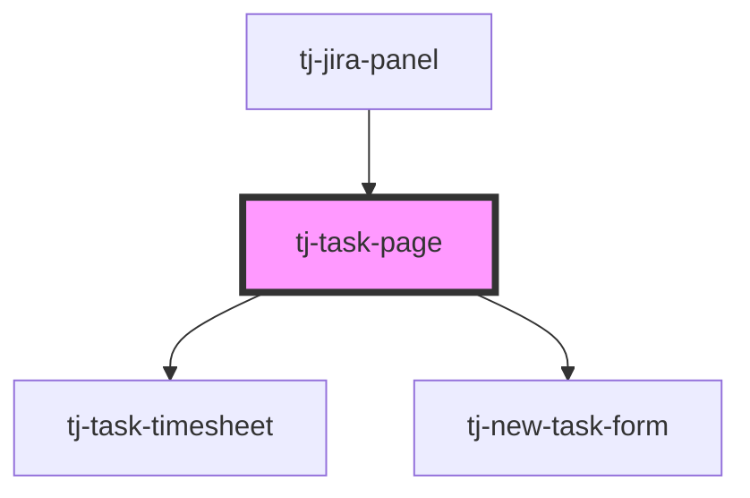

# tj-task-page

<!-- Auto Generated Below -->

## Overview

Main component that decides whether to show the task timesheet or the new task form.

## Properties

| Property                   | Attribute      | Description              | Type     | Default     |
| -------------------------- | -------------- | ------------------------ | -------- | ----------- |
| `jiraID` _(required)_      | `jira-id`      | The Jira ID of the task. | `string` | `undefined` |
| `jiraSummary` _(required)_ | `jira-summary` | The summary of the task. | `string` | `undefined` |

## Events

| Event          | Description                                                                                                        | Type                        |
| -------------- | ------------------------------------------------------------------------------------------------------------------ | --------------------------- |
| `notification` | Emitted when a notification needs to be displayed. Requires the component to be inside a `notifications-provider`. | `CustomEvent<Notification>` |

## Dependencies

### Used by

 - [tj-jira-panel](../tj-jira-panel)

### Depends on

- [tj-task-timesheet](./components/tj-task-timesheet)
- [tj-new-task-form](./components/tj-new-task-form)

### Graph

----------------------------------------------

*Built with [StencilJS](https://stenciljs.com/)*
